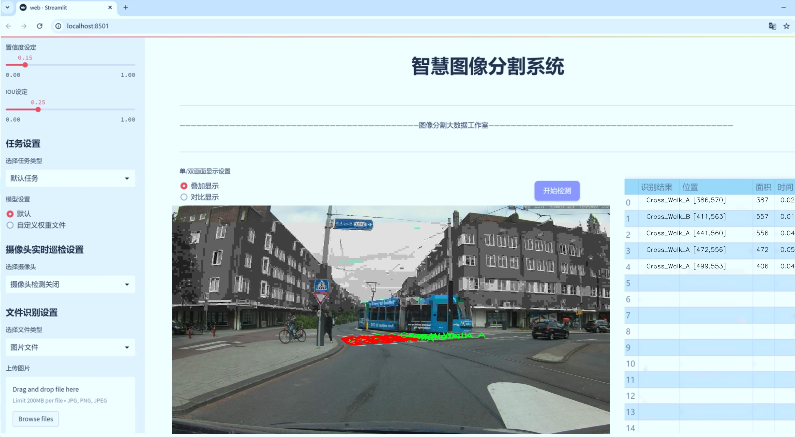
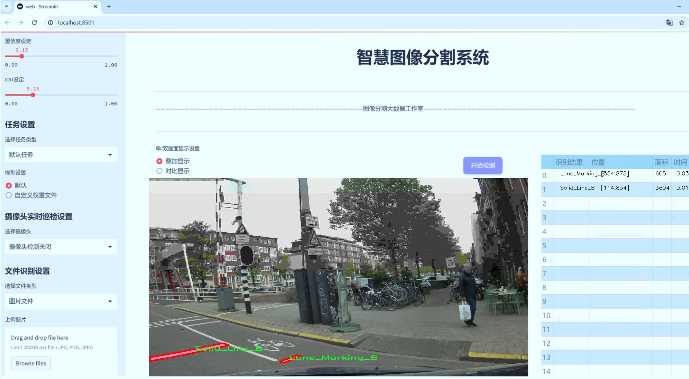
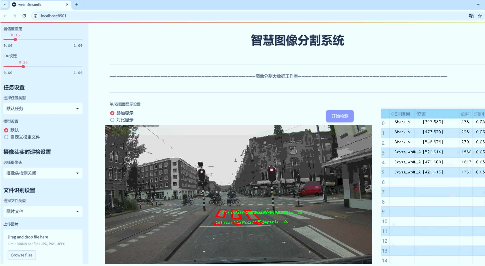
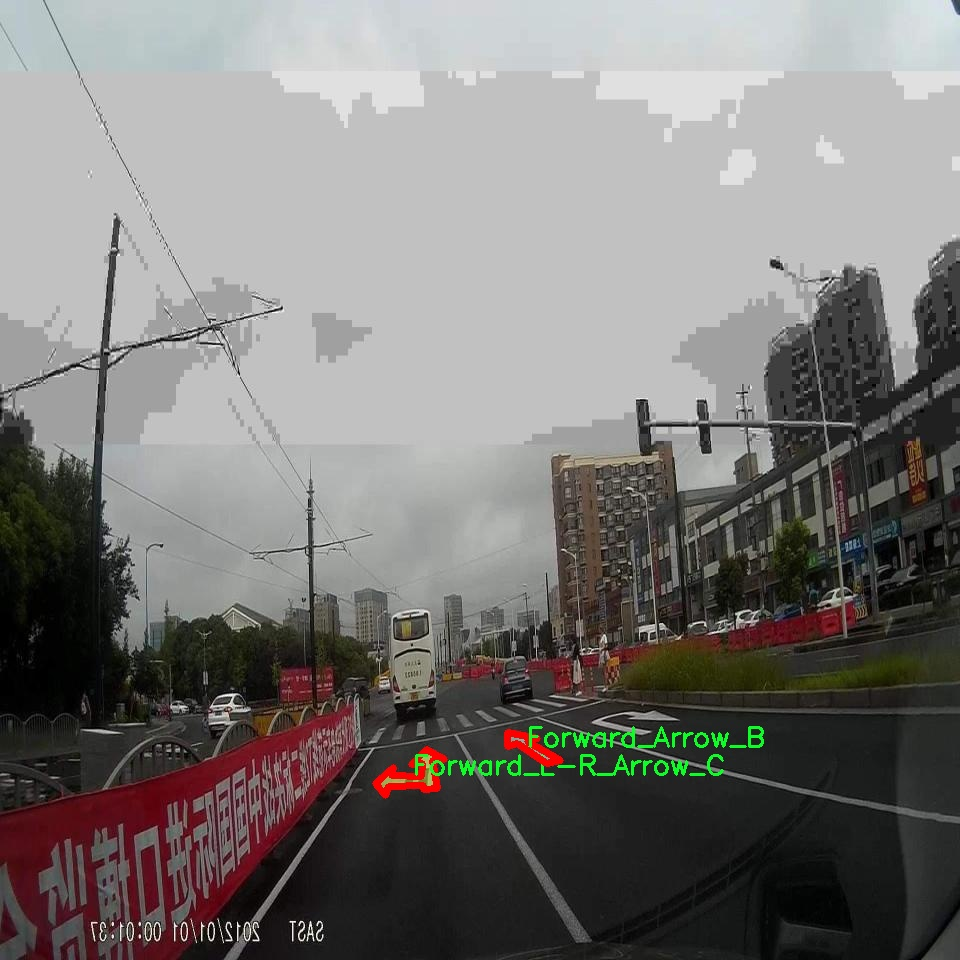
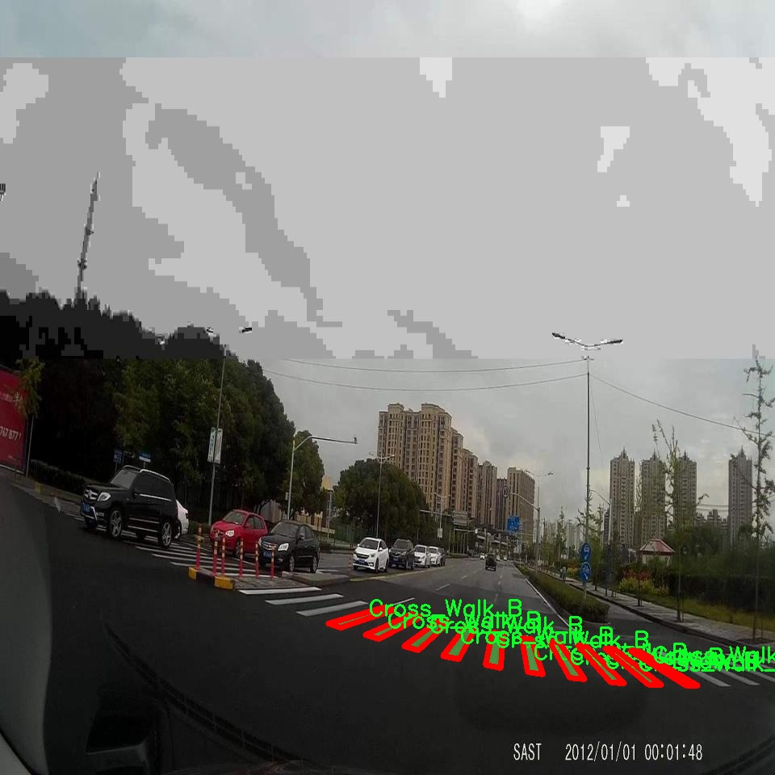
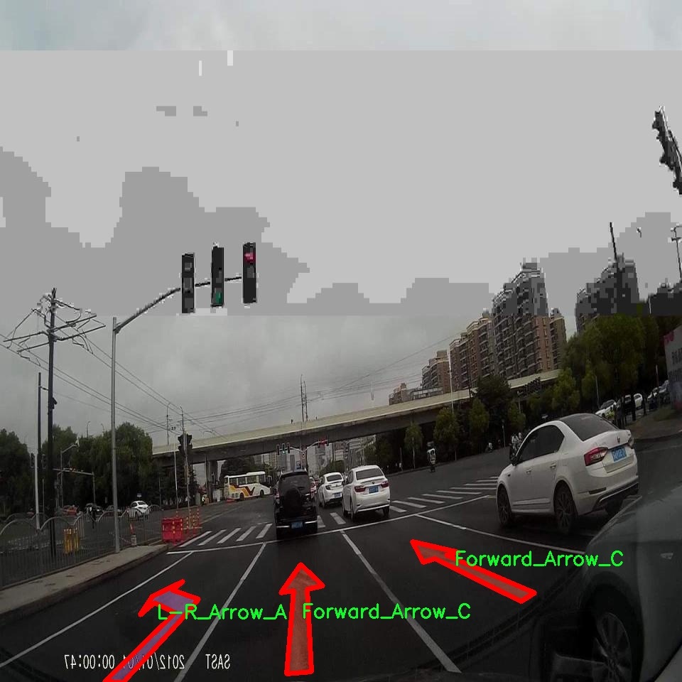
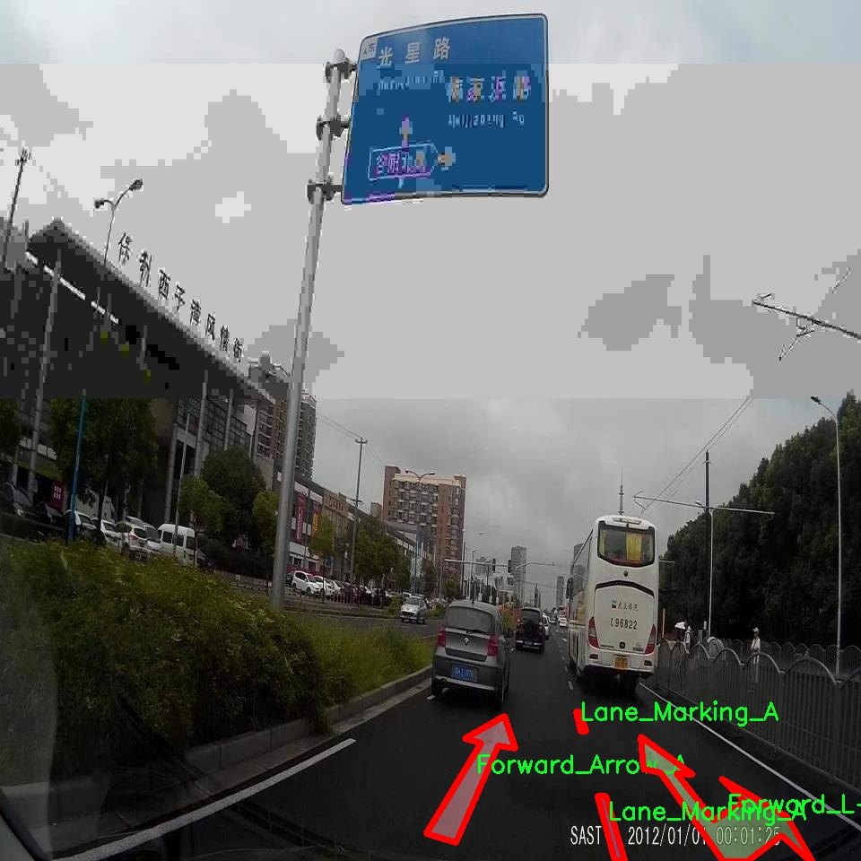
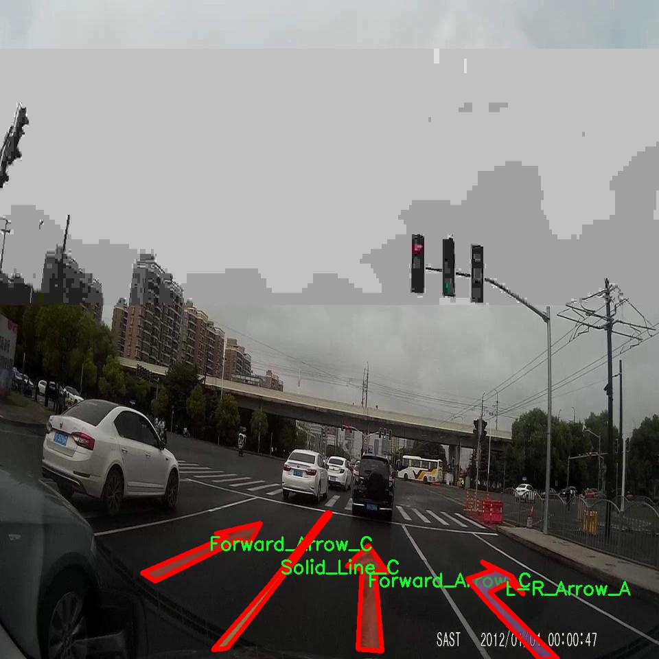

# 交通标志与道路标线分割系统源码＆数据集分享
 [yolov8-seg-C2f-CloAtt＆yolov8-seg-EfficientFormerV2等50+全套改进创新点发刊_一键训练教程_Web前端展示]

### 1.研究背景与意义

项目参考[ILSVRC ImageNet Large Scale Visual Recognition Challenge](https://gitee.com/YOLOv8_YOLOv11_Segmentation_Studio/projects)

项目来源[AAAI Global Al lnnovation Contest](https://kdocs.cn/l/cszuIiCKVNis)

研究背景与意义

随着城市化进程的加快，交通管理的复杂性日益增加，交通安全问题愈发凸显。交通标志和道路标线作为交通管理的重要组成部分，对于引导驾驶行为、保障行车安全、提高交通效率具有不可或缺的作用。然而，传统的交通标志与道路标线的检测与识别方法多依赖人工巡查，效率低下且容易出现漏检和误检现象。因此，构建一个高效、准确的交通标志与道路标线分割系统显得尤为重要。

近年来，深度学习技术的迅猛发展为计算机视觉领域带来了新的机遇，尤其是在目标检测和分割任务中表现出色。YOLO（You Only Look Once）系列模型因其高效的实时检测能力和较高的准确率，成为了目标检测领域的研究热点。YOLOv8作为该系列的最新版本，进一步优化了模型结构和算法，提升了检测精度和速度。基于YOLOv8的交通标志与道路标线分割系统，能够在复杂的交通环境中快速、准确地识别和分割各种交通标志和道路标线，从而为智能交通系统的建设提供技术支持。

本研究所使用的数据集包含2300张图像，涵盖47个类别的交通标志和道路标线，包括各种类型的自行车标志、行人过街标志、车道标线、箭头标志等。这些类别的多样性使得模型在训练过程中能够学习到丰富的特征，从而提高模型的泛化能力和识别准确率。此外，数据集中不同类别的标注信息为模型的实例分割提供了充分的训练样本，确保了模型在实际应用中的有效性。

通过改进YOLOv8模型，本研究旨在提升交通标志与道路标线的分割精度，解决现有技术在复杂场景下的不足之处。研究成果不仅可以为智能交通系统的实时监控提供支持，还可以为自动驾驶技术的发展奠定基础。随着自动驾驶技术的不断成熟，准确的交通标志与道路标线识别将成为保障行车安全的重要环节。因此，本研究的意义不仅在于技术层面的创新，更在于其对交通安全和智能交通发展的深远影响。

综上所述，基于改进YOLOv8的交通标志与道路标线分割系统的研究，不仅具有重要的学术价值，还有助于推动交通管理的智能化进程，提升城市交通的安全性和效率。通过深入探索和优化这一系统，期望能够为未来的交通管理提供更为科学、有效的解决方案。

### 2.图片演示







##### 注意：由于此博客编辑较早，上面“2.图片演示”和“3.视频演示”展示的系统图片或者视频可能为老版本，新版本在老版本的基础上升级如下：（实际效果以升级的新版本为准）

  （1）适配了YOLOV8的“目标检测”模型和“实例分割”模型，通过加载相应的权重（.pt）文件即可自适应加载模型。

  （2）支持“图片识别”、“视频识别”、“摄像头实时识别”三种识别模式。

  （3）支持“图片识别”、“视频识别”、“摄像头实时识别”三种识别结果保存导出，解决手动导出（容易卡顿出现爆内存）存在的问题，识别完自动保存结果并导出到tempDir中。

  （4）支持Web前端系统中的标题、背景图等自定义修改，后面提供修改教程。

  另外本项目提供训练的数据集和训练教程,暂不提供权重文件（best.pt）,需要您按照教程进行训练后实现图片演示和Web前端界面演示的效果。

### 3.视频演示

[3.1 视频演示](https://www.bilibili.com/video/BV1pi2cYcEN9/)

### 4.数据集信息展示

##### 4.1 本项目数据集详细数据（类别数＆类别名）

nc: 44
names: ['Bicycle_A', 'Bicycle_B', 'Bicycle_C', 'Bicycle_D', 'Cross_Walk_A', 'Cross_Walk_B', 'Cross_Walk_C', 'Cross_Walk_D', 'Dotted_Line_A', 'Dotted_Line_B', 'Dotted_Line_C', 'Dotted_Line_D', 'Forward_Arrow_A', 'Forward_Arrow_B', 'Forward_Arrow_C', 'Forward_L-R_Arrow_A', 'Forward_L-R_Arrow_B', 'Forward_L-R_Arrow_C', 'L-R_Arrow_A', 'L-R_Arrow_B', 'L-R_Arrow_C', 'LUN_BUS_A', 'LUN_BUS_B', 'Lane_Marking_A', 'Lane_Marking_B', 'Lane_Marking_C', 'Lane_Marking_D', 'Semi_Circle_A', 'Semi_Circle_D', 'Shark_A', 'Shark_B', 'Shark_C', 'Shark_D', 'Solid_Line_A', 'Solid_Line_B', 'Solid_Line_C', 'Solid_Line_D', 'Square_A', 'Square_B', 'Square_C', 'Square_D', 'V_A', 'V_B', 'V_C']


##### 4.2 本项目数据集信息介绍

数据集信息展示

在本研究中，我们采用了名为“markingss”的数据集，以改进YOLOv8-seg模型在交通标志与道路标线分割任务中的表现。该数据集包含44个类别，涵盖了多种交通标志和道路标线的类型，旨在为深度学习模型提供丰富的训练样本，从而提高其在实际应用中的准确性和鲁棒性。

“markingss”数据集的类别列表包括了多种交通标志和标线的细分类型。首先，交通标志部分涵盖了多种自行车相关的标志，如‘Bicycle_A’、‘Bicycle_B’、‘Bicycle_C’和‘Bicycle_D’，这些标志在城市交通中起着重要的指引作用，确保骑行者的安全。接下来是人行横道标志，分为‘Cross_Walk_A’、‘Cross_Walk_B’、‘Cross_Walk_C’和‘Cross_Walk_D’，这些标志的设计旨在提高行人过马路时的可见性，减少交通事故的发生。

此外，数据集中还包含了多种类型的道路标线，如虚线和实线，分别用‘Dotted_Line_A’至‘Dotted_Line_D’和‘Solid_Line_A’至‘Solid_Line_D’进行标识。这些标线在道路交通管理中至关重要，帮助驾驶员识别车道、超车和停车区域等信息。为了进一步细化标线的功能，数据集还引入了方向箭头标志，包括‘Forward_Arrow_A’、‘Forward_Arrow_B’、‘Forward_Arrow_C’和‘Forward_L-R_Arrow_A’等，这些箭头指示了车辆的行驶方向，确保交通流畅。

值得注意的是，数据集中还包含了特定形状的标志，如‘Semi_Circle_A’、‘Semi_Circle_D’、‘Square_A’至‘Square_D’等，这些形状的标志在不同的交通场景中有着不同的应用。比如，半圆形标志通常用于指示特定的交通规则，而方形标志则可能用于提供信息或警告。

在标线的细分方面，数据集提供了多种类型的车道标记，如‘Lane_Marking_A’、‘Lane_Marking_B’、‘Lane_Marking_C’和‘Lane_Marking_D’，这些标记在城市和高速公路中均有广泛应用，帮助驾驶员保持在正确的车道内。此外，数据集中还包括了特殊的标志，如‘Shark_A’、‘Shark_B’、‘Shark_C’和‘Shark_D’，这些标志通常用于警示驾驶员注意潜在的危险。

通过使用“markingss”数据集，我们能够为YOLOv8-seg模型提供多样化的训练样本，增强其对交通标志和道路标线的识别能力。该数据集的丰富性和多样性将为模型的训练提供坚实的基础，助力于提升智能交通系统的智能化水平和安全性。随着交通管理的不断发展，准确识别和理解交通标志与道路标线的能力将变得愈发重要，而“markingss”数据集正是实现这一目标的重要工具。











### 5.全套项目环境部署视频教程（零基础手把手教学）

[5.1 环境部署教程链接（零基础手把手教学）](https://www.bilibili.com/video/BV1jG4Ve4E9t/?vd_source=bc9aec86d164b67a7004b996143742dc)


[5.2 安装Python虚拟环境创建和依赖库安装视频教程链接（零基础手把手教学）](https://www.bilibili.com/video/BV1nA4VeYEze/?vd_source=bc9aec86d164b67a7004b996143742dc)

### 6.手把手YOLOV8-seg训练视频教程（零基础小白有手就能学会）

[6.1 手把手YOLOV8-seg训练视频教程（零基础小白有手就能学会）](https://www.bilibili.com/video/BV1cA4VeYETe/?vd_source=bc9aec86d164b67a7004b996143742dc)


按照上面的训练视频教程链接加载项目提供的数据集，运行train.py即可开始训练



     Epoch   gpu_mem       box       obj       cls    labels  img_size
     1/200     0G   0.01576   0.01955  0.007536        22      1280: 100%|██████████| 849/849 [14:42<00:00,  1.04s/it]
               Class     Images     Labels          P          R     mAP@.5 mAP@.5:.95: 100%|██████████| 213/213 [01:14<00:00,  2.87it/s]
                 all       3395      17314      0.994      0.957      0.0957      0.0843

     Epoch   gpu_mem       box       obj       cls    labels  img_size
     2/200     0G   0.01578   0.01923  0.007006        22      1280: 100%|██████████| 849/849 [14:44<00:00,  1.04s/it]
               Class     Images     Labels          P          R     mAP@.5 mAP@.5:.95: 100%|██████████| 213/213 [01:12<00:00,  2.95it/s]
                 all       3395      17314      0.996      0.956      0.0957      0.0845

     Epoch   gpu_mem       box       obj       cls    labels  img_size
     3/200     0G   0.01561    0.0191  0.006895        27      1280: 100%|██████████| 849/849 [10:56<00:00,  1.29it/s]
               Class     Images     Labels          P          R     mAP@.5 mAP@.5:.95: 100%|███████   | 187/213 [00:52<00:00,  4.04it/s]
                 all       3395      17314      0.996      0.957      0.0957      0.0845


### 7.50+种全套YOLOV8-seg创新点代码加载调参视频教程（一键加载写好的改进模型的配置文件）

[7.1 50+种全套YOLOV8-seg创新点代码加载调参视频教程（一键加载写好的改进模型的配置文件）](https://www.bilibili.com/video/BV1Hw4VePEXv/?vd_source=bc9aec86d164b67a7004b996143742dc)

### 8.YOLOV8-seg图像分割算法原理

原始YOLOv8-seg算法原理

YOLOv8-seg算法是目标检测领域中的一项重要进展，其核心在于通过引入先进的网络结构和创新的技术手段，提升目标检测的精度和效率。该算法的设计基于YOLO系列的成功经验，尤其是YOLOv5和YOLOv7，旨在解决传统目标检测方法在处理复杂场景时的局限性。YOLOv8-seg不仅继承了YOLO系列的优良特性，还在多个方面进行了改进和创新，尤其是在特征提取、特征融合和目标分类等关键环节。

在YOLOv8-seg的架构中，主要分为三个部分：Backbone、Neck和Head。Backbone部分负责特征提取，采用了一系列卷积和反卷积层，结合残差连接和瓶颈结构，旨在减小网络的规模并提高性能。YOLOv8-seg使用了C2f模块作为基本构成单元，这一模块的设计灵感来源于YOLOv5的C3模块和YOLOv7的ELAN思想。C2f模块通过引入多个shortcut连接，缓解了深层网络中的梯度消失问题，同时增强了浅层特征的重用能力。这种设计使得YOLOv8-seg在特征提取时能够更加高效地捕捉到目标的细节信息和语义信息。

Neck部分则采用了PAN-FPN结构，以实现多尺度特征的深度融合。通过对来自Backbone不同阶段的特征图进行有效的融合，YOLOv8-seg能够更好地捕捉到不同尺度目标的信息，从而提升检测的性能和鲁棒性。在这一过程中，YOLOv8-seg取消了YOLOv5中上采样阶段的1x1卷积，直接将高层特征进行上采样后与中层特征进行Concat叠加。这种设计不仅提高了特征融合的效率，还有效地保留了目标的细节信息，使得算法在复杂场景下的表现更加出色。

在Head部分，YOLOv8-seg引入了Anchor-Free的思想，摒弃了传统的Anchor-Base方法。这一创新使得目标检测过程更加灵活，尤其是在处理小目标和密集目标时，能够显著提高检测精度。YOLOv8-seg的Head结构由多个解耦头组成，分别负责目标的分类和边框回归。通过将分类和回归任务进行解耦，YOLOv8-seg能够在不同尺度的特征图上进行目标检测，输出的特征图尺寸为80x80、40x40和20x20，确保了对不同尺寸目标的有效检测。

为了进一步提升算法的性能，YOLOv8-seg采用了VFLLoss和DFLLoss+CIoULoss作为损失函数。这些损失函数的设计旨在解决样本不平衡和困难样本的问题，尤其是在处理小目标时，能够有效提高网络的学习效率和收敛速度。此外，YOLOv8-seg还引入了Task-Aligned的样本匹配策略，进一步优化了训练过程中的样本选择和匹配方式，使得网络在训练时能够更加专注于困难样本，从而提升整体检测性能。

在数据预处理方面，YOLOv8-seg借鉴了YOLOv5的策略，采用了多种数据增强手段，如马赛克增强、混合增强、空间扰动和颜色扰动等。这些增强手段的应用不仅丰富了训练数据的多样性，还有效提高了模型的泛化能力，使得YOLOv8-seg在面对不同场景和条件时，能够保持较高的检测精度。

综上所述，YOLOv8-seg算法通过对Backbone、Neck和Head的精心设计与优化，结合先进的损失函数和数据增强策略，展现出了在目标检测领域的强大能力。其创新的Anchor-Free思想和高效的特征融合机制，使得YOLOv8-seg在处理复杂场景和小目标时，能够显著提升检测精度，展现出其作为当前SOTA算法的潜力。随着YOLOv8-seg的不断发展和应用，其在实际场景中的表现值得期待，也为未来的目标检测研究提供了新的思路和方向。


### 9.系统功能展示（检测对象为举例，实际内容以本项目数据集为准）

图9.1.系统支持检测结果表格显示

  图9.2.系统支持置信度和IOU阈值手动调节

  图9.3.系统支持自定义加载权重文件best.pt(需要你通过步骤5中训练获得)

  图9.4.系统支持摄像头实时识别

  图9.5.系统支持图片识别

  图9.6.系统支持视频识别

  图9.7.系统支持识别结果文件自动保存

  图9.8.系统支持Excel导出检测结果数据


### 10.50+种全套YOLOV8-seg创新点原理讲解（非科班也可以轻松写刊发刊，V11版本正在科研待更新）

#### 10.1 由于篇幅限制，每个创新点的具体原理讲解就不一一展开，具体见下列网址中的创新点对应子项目的技术原理博客网址【Blog】：


[10.1 50+种全套YOLOV8-seg创新点原理讲解链接](https://gitee.com/qunmasj/good)

#### 10.2 部分改进模块原理讲解(完整的改进原理见上图和技术博客链接)【此小节的图要是加载失败请移步原始博客查看，链接：https://blog.csdn.net/cheng2333333?type=blog】
### YOLOv8简介
#### Backbone


借鉴了其他算法的这些设计思想

借鉴了VGG的思想，使用了较多的3×3卷积，在每一次池化操作后，将通道数翻倍；

借鉴了network in network的思想，使用全局平均池化（global average pooling）做预测，并把1×1的卷积核置于3×3的卷积核之间，用来压缩特征；（我没找到这一步体现在哪里）

使用了批归一化层稳定模型训练，加速收敛，并且起到正则化作用。

    以上三点为Darknet19借鉴其他模型的点。Darknet53当然是在继承了Darknet19的这些优点的基础上再新增了下面这些优点的。因此列在了这里

借鉴了ResNet的思想，在网络中大量使用了残差连接，因此网络结构可以设计的很深，并且缓解了训练中梯度消失的问题，使得模型更容易收敛。

使用步长为2的卷积层代替池化层实现降采样。（这一点在经典的Darknet-53上是很明显的，output的长和宽从256降到128，再降低到64，一路降低到8，应该是通过步长为2的卷积层实现的；在YOLOv8的卷积层中也有体现，比如图中我标出的这些位置）

#### 特征融合

模型架构图如下

  Darknet-53的特点可以这样概括：（Conv卷积模块+Residual Block残差块）串行叠加4次

  Conv卷积层+Residual Block残差网络就被称为一个stage


上面红色指出的那个，原始的Darknet-53里面有一层 卷积，在YOLOv8里面，把一层卷积移除了

为什么移除呢？

        原始Darknet-53模型中间加的这个卷积层做了什么？滤波器（卷积核）的个数从 上一个卷积层的512个，先增加到1024个卷积核，然后下一层卷积的卷积核的个数又降低到512个

        移除掉这一层以后，少了1024个卷积核，就可以少做1024次卷积运算，同时也少了1024个3×3的卷积核的参数，也就是少了9×1024个参数需要拟合。这样可以大大减少了模型的参数，（相当于做了轻量化吧）

        移除掉这个卷积层，可能是因为作者发现移除掉这个卷积层以后，模型的score有所提升，所以才移除掉的。为什么移除掉以后，分数有所提高呢？可能是因为多了这些参数就容易，参数过多导致模型在训练集删过拟合，但是在测试集上表现很差，最终模型的分数比较低。你移除掉这个卷积层以后，参数减少了，过拟合现象不那么严重了，泛化能力增强了。当然这个是，拿着你做实验的结论，反过来再找补，再去强行解释这种现象的合理性。

过拟合


通过MMdetection官方绘制册这个图我们可以看到，进来的这张图片经过一个“Feature Pyramid Network(简称FPN)”，然后最后的P3、P4、P5传递给下一层的Neck和Head去做识别任务。 PAN（Path Aggregation Network）


“FPN是自顶向下，将高层的强语义特征传递下来。PAN就是在FPN的后面添加一个自底向上的金字塔，对FPN补充，将低层的强定位特征传递上去，

FPN是自顶（小尺寸，卷积次数多得到的结果，语义信息丰富）向下（大尺寸，卷积次数少得到的结果），将高层的强语义特征传递下来，对整个金字塔进行增强，不过只增强了语义信息，对定位信息没有传递。PAN就是针对这一点，在FPN的后面添加一个自底（卷积次数少，大尺寸）向上（卷积次数多，小尺寸，语义信息丰富）的金字塔，对FPN补充，将低层的强定位特征传递上去，又被称之为“双塔战术”。

FPN层自顶向下传达强语义特征，而特征金字塔则自底向上传达强定位特征，两两联手，从不同的主干层对不同的检测层进行参数聚合,这样的操作确实很皮。
#### 自底向上增强

而 PAN（Path Aggregation Network）是对 FPN 的一种改进，它的设计理念是在 FPN 后面添加一个自底向上的金字塔。PAN 引入了路径聚合的方式，通过将浅层特征图（低分辨率但语义信息较弱）和深层特征图（高分辨率但语义信息丰富）进行聚合，并沿着特定的路径传递特征信息，将低层的强定位特征传递上去。这样的操作能够进一步增强多尺度特征的表达能力，使得 PAN 在目标检测任务中表现更加优秀。


### 可重参化EfficientRepBiPAN优化Neck
#### Repvgg-style
Repvgg-style的卷积层包含
卷积+ReLU结构，该结构能够有效地利用硬件资源。

在训练时，Repvgg-style的卷积层包含
卷积、
卷积、identity。（下图左图）


在推理时，通过重参数化（re-parameterization），上述的多分支结构可以转换为单分支的
卷积。（下图右图）


基于上述思想，作者设计了对GPU硬件友好的EfficientRep Backbone和Rep-PAN Neck，将它们用于YOLOv6中。

EfficientRep Backbone的结构图：


Rep-PAN Neck结构图：


#### Multi-path
只使用repvgg-style不能达到很好的精度-速度平衡，对于大模型，作者探索了多路径的网络结构。

参考该博客提出了Bep unit，其结构如下图所示：


CSP（Cross Stage Partial）-style计算量小，且有丰富的梯度融合信息，广泛应用于YOLO系列中，比如YOLOv5、PPYOLOE。

作者将Bep unit与CSP-style结合，设计了一种新的网络结构BepC3，如下图所示：


基于BepC3模块，作者设计了新的CSPBep Backbone和CSPRepPAN Neck，以达到很好的精度-速度平衡。

其他YOLO系列在使用CSP-stype结构时，partial ratio设置为1/2。为了达到更好的性能，在YOLOv6m中partial ratio的值为2/3，在YOLOv6l中partial ratio的值为1/2。

对于YOLOv6m，单纯使用Rep-style结构和使用BepC3结构的对比如下图所示：

#### BIFPN
BiFPN 全称 Bidirectional Feature Pyramid Network 加权双向（自顶向下 + 自低向上）特征金字塔网络。

相比较于PANet，BiFPN在设计上的改变：

总结下图：
图d 蓝色部分为自顶向下的通路，传递的是高层特征的语义信息；红色部分是自底向上的通路，传递的是低层特征的位置信息；紫色部分是上述第二点提到的同一层在输入节点和输入节点间新加的一条边。


我们删除那些只有一条输入边的节点。这么做的思路很简单：如果一个节点只有一条输入边而没有特征融合，那么它对旨在融合不同特征的特征网络的贡献就会很小。删除它对我们的网络影响不大，同时简化了双向网络；如上图d 的 P7右边第一个节点

如果原始输入节点和输出节点处于同一层，我们会在原始输入节点和输出节点之间添加一条额外的边。思路：以在不增加太多成本的情况下融合更多的特性；

与只有一个自顶向下和一个自底向上路径的PANet不同，我们处理每个双向路径(自顶向下和自底而上)路径作为一个特征网络层，并重复同一层多次，以实现更高层次的特征融合。如下图EfficientNet 的网络结构所示，我们对BiFPN是重复使用多次的。而这个使用次数也不是我们认为设定的，而是作为参数一起加入网络的设计当中，使用NAS技术算出来的。


Weighted Feature Fusion 带权特征融合：学习不同输入特征的重要性，对不同输入特征有区分的融合。
设计思路：传统的特征融合往往只是简单的 feature map 叠加/相加 (sum them up)，比如使用concat或者shortcut连接，而不对同时加进来的 feature map 进行区分。然而，不同的输入 feature map 具有不同的分辨率，它们对融合输入 feature map 的贡献也是不同的，因此简单的对他们进行相加或叠加处理并不是最佳的操作。所以这里我们提出了一种简单而高效的加权特融合的机制。
常见的带权特征融合有三种方法，分别是：


​
  这种方法比较简单，直接加一个可学习的权重。但是由于这个权重不受限制，所有可能引起训练的不稳定，所有并不推荐。
Softmax-based fusion: O = ∑ i e w i ∗ I i ϵ + ∑ j e w j O = \sum_{i} \frac{e^{w_i} * I_i}{ \epsilon+\sum_{j}e^{w_j}}O=∑ 

 

​
  使用这种方法可以将范围放缩到 [ 0 , 1 ] [0, 1][0,1] 之间，训练稳定，但是训练很慢，所有也不推荐。
Fast normalized fusion: O = ∑ i w i ∗ I i ϵ + ∑ j w j O = \sum_{i} \frac{w_i * I_i}{ \epsilon+\sum_{j}w_j}O=∑ 


### 11.项目核心源码讲解（再也不用担心看不懂代码逻辑）

#### 11.1 ultralytics\data\__init__.py

以下是对代码的核心部分进行提炼和详细注释的结果：

```python
# 引入必要的模块和类
# Ultralytics YOLO 🚀, AGPL-3.0 license

# 导入基础数据集类
from .base import BaseDataset

# 导入构建数据加载器和YOLO数据集的函数
from .build import build_dataloader, build_yolo_dataset, load_inference_source

# 导入特定类型的数据集类
from .dataset import ClassificationDataset, SemanticDataset, YOLODataset

# 定义模块的公开接口，方便其他模块导入使用
__all__ = (
    'BaseDataset',          # 基础数据集类
    'ClassificationDataset', # 分类数据集类
    'SemanticDataset',      # 语义分割数据集类
    'YOLODataset',          # YOLO特定数据集类
    'build_yolo_dataset',   # 构建YOLO数据集的函数
    'build_dataloader',     # 构建数据加载器的函数
    'load_inference_source'  # 加载推理源的函数
)
```

### 代码分析与注释

1. **模块导入**：
   - `from .base import BaseDataset`：导入基础数据集类`BaseDataset`，这个类可能包含了数据集的基本功能和属性，供其他数据集类继承和扩展。
   - `from .build import build_dataloader, build_yolo_dataset, load_inference_source`：导入构建数据加载器和YOLO数据集的相关函数。这些函数用于创建数据加载器和初始化数据集，支持模型训练和推理。
   - `from .dataset import ClassificationDataset, SemanticDataset, YOLODataset`：导入特定类型的数据集类，包括分类数据集、语义分割数据集和YOLO数据集。这些类可能实现了针对不同任务的数据处理和加载逻辑。

2. **公开接口定义**：
   - `__all__`：这是一个特殊的变量，用于定义模块的公开接口。通过定义`__all__`，可以控制哪些类和函数可以被`from module import *`语句导入。这有助于隐藏内部实现细节，只暴露必要的功能给用户。

### 总结
以上代码主要是模块的导入和接口定义，核心在于提供数据集和数据加载器的构建功能，以支持YOLO模型的训练和推理。

这个文件是Ultralytics YOLO项目中的一个初始化文件，通常用于定义模块的公共接口。在这个文件中，首先以注释的形式标明了项目的名称和许可证类型，表明该项目是Ultralytics开发的YOLO（You Only Look Once）目标检测框架，并且遵循AGPL-3.0许可证。

接下来，文件通过相对导入的方式引入了几个模块和类。这些模块和类分别是`BaseDataset`、`build_dataloader`、`build_yolo_dataset`、`load_inference_source`、`ClassificationDataset`、`SemanticDataset`和`YOLODataset`。这些导入的内容构成了YOLO框架中数据处理和数据集构建的基础。

`BaseDataset`类可能是所有数据集类的基类，提供了一些通用的方法和属性。`ClassificationDataset`、`SemanticDataset`和`YOLODataset`则是具体的数据集实现，分别用于分类、语义分割和YOLO目标检测任务。

此外，`build_dataloader`和`build_yolo_dataset`函数用于构建数据加载器和YOLO数据集，这些功能对于训练和推理过程中的数据处理至关重要。`load_inference_source`函数则可能用于加载推理所需的数据源。

最后，`__all__`变量定义了模块的公共接口，列出了可以被外部导入的类和函数。这有助于用户了解该模块提供的功能，并确保在使用`from module import *`时只导入这些指定的内容。

总的来说，这个文件在Ultralytics YOLO项目中起到了组织和管理数据集相关功能的作用，使得其他模块可以方便地使用这些功能。

#### 11.2 ui.py

以下是保留的核心代码部分，并附上详细的中文注释：

```python
import sys
import subprocess

def run_script(script_path):
    """
    使用当前 Python 环境运行指定的脚本。

    Args:
        script_path (str): 要运行的脚本路径

    Returns:
        None
    """
    # 获取当前 Python 解释器的路径
    python_path = sys.executable

    # 构建运行命令，使用 streamlit 运行指定的脚本
    command = f'"{python_path}" -m streamlit run "{script_path}"'

    # 执行命令，并等待其完成
    result = subprocess.run(command, shell=True)
    
    # 检查命令执行结果，如果返回码不为0，表示出错
    if result.returncode != 0:
        print("脚本运行出错。")

# 主程序入口
if __name__ == "__main__":
    # 指定要运行的脚本路径
    script_path = "web.py"  # 这里可以直接指定脚本路径

    # 调用函数运行脚本
    run_script(script_path)
```

### 代码注释说明：
1. **导入模块**：
   - `sys`：用于访问与 Python 解释器紧密相关的变量和函数。
   - `subprocess`：用于创建新进程、连接到它们的输入/输出/错误管道，并获得返回码。

2. **定义 `run_script` 函数**：
   - 该函数接收一个脚本路径作为参数，并在当前 Python 环境中运行该脚本。

3. **获取 Python 解释器路径**：
   - 使用 `sys.executable` 获取当前 Python 解释器的完整路径，以确保使用正确的 Python 环境来运行脚本。

4. **构建命令**：
   - 使用 f-string 格式化字符串构建命令，调用 `streamlit` 模块来运行指定的脚本。

5. **执行命令**：
   - 使用 `subprocess.run` 方法执行构建的命令，并等待其完成。

6. **检查执行结果**：
   - 检查命令的返回码，如果返回码不为0，表示脚本运行过程中出现了错误，并打印相应的错误信息。

7. **主程序入口**：
   - 在 `if __name__ == "__main__":` 块中，指定要运行的脚本路径，并调用 `run_script` 函数来执行该脚本。

这个程序文件名为 `ui.py`，其主要功能是使用当前的 Python 环境来运行一个指定的脚本，具体是一个名为 `web.py` 的文件。程序首先导入了必要的模块，包括 `sys`、`os` 和 `subprocess`，这些模块分别用于访问系统参数、与操作系统交互以及执行外部命令。

在 `run_script` 函数中，首先获取当前 Python 解释器的路径，这通过 `sys.executable` 实现。接着，构建一个命令字符串，该命令用于运行 `streamlit`，这是一个用于构建数据应用的库。命令的格式为 `"{python_path}" -m streamlit run "{script_path}"`，其中 `python_path` 是当前 Python 解释器的路径，`script_path` 是要运行的脚本路径。

然后，使用 `subprocess.run` 函数执行这个命令，`shell=True` 参数允许在 shell 中执行命令。执行后，程序检查返回码，如果返回码不为零，表示脚本运行出错，程序会打印出错误信息。

在文件的最后部分，使用 `if __name__ == "__main__":` 语句来确保当这个文件作为主程序运行时，以下代码才会被执行。这里指定了要运行的脚本路径为 `web.py`，并调用 `run_script` 函数来执行这个脚本。

总的来说，这个程序的作用是为 `web.py` 提供一个运行环境，确保它可以在当前的 Python 环境中通过 `streamlit` 运行。

#### 11.3 train.py

以下是经过简化并添加详细中文注释的核心代码部分：

```python
import os
import torch
import yaml
from ultralytics import YOLO  # 导入YOLO模型库

if __name__ == '__main__':  # 确保该模块被直接运行时才执行以下代码
    # 设置训练参数
    workers = 1  # 数据加载的工作进程数
    batch = 8  # 每个批次的样本数量
    device = "0" if torch.cuda.is_available() else "cpu"  # 判断是否使用GPU

    # 获取数据集配置文件的绝对路径
    data_path = abs_path(f'datasets/data/data.yaml', path_type='current')

    # 将路径转换为Unix风格
    unix_style_path = data_path.replace(os.sep, '/')
    # 获取目录路径
    directory_path = os.path.dirname(unix_style_path)

    # 读取YAML文件，保持原有顺序
    with open(data_path, 'r') as file:
        data = yaml.load(file, Loader=yaml.FullLoader)

    # 修改数据集路径
    if 'train' in data and 'val' in data and 'test' in data:
        data['train'] = directory_path + '/train'  # 更新训练集路径
        data['val'] = directory_path + '/val'      # 更新验证集路径
        data['test'] = directory_path + '/test'    # 更新测试集路径

        # 将修改后的数据写回YAML文件
        with open(data_path, 'w') as file:
            yaml.safe_dump(data, file, sort_keys=False)

    # 加载YOLO模型配置文件和预训练权重
    model = YOLO(r"C:\codeseg\codenew\50+种YOLOv8算法改进源码大全和调试加载训练教程（非必要）\改进YOLOv8模型配置文件\yolov8-seg-C2f-Faster.yaml").load("./weights/yolov8s-seg.pt")

    # 开始训练模型
    results = model.train(
        data=data_path,  # 指定训练数据的配置文件路径
        device=device,  # 使用指定的设备进行训练
        workers=workers,  # 指定使用的工作进程数
        imgsz=640,  # 输入图像的大小为640x640
        epochs=100,  # 训练100个epoch
        batch=batch,  # 每个批次的大小为8
    )
```

### 代码注释说明：
1. **导入必要的库**：导入操作系统、PyTorch、YAML解析库和YOLO模型库。
2. **主程序入口**：确保代码在直接运行时执行。
3. **设置训练参数**：定义数据加载的工作进程数、批次大小和设备（GPU或CPU）。
4. **获取数据集配置文件路径**：使用`abs_path`函数获取数据集配置文件的绝对路径，并转换为Unix风格路径。
5. **读取和修改YAML文件**：读取YAML文件内容，更新训练、验证和测试集的路径，并将修改后的内容写回文件。
6. **加载YOLO模型**：根据指定的配置文件和预训练权重加载YOLO模型。
7. **开始训练模型**：调用`train`方法进行模型训练，传入必要的参数如数据路径、设备、工作进程数、图像大小、训练轮数和批次大小。

这个程序文件`train.py`主要用于训练YOLO（You Only Look Once）模型，具体是YOLOv8版本的一个变体，通常用于目标检测或图像分割任务。程序的结构和功能可以分为几个主要部分。

首先，程序导入了必要的库，包括`os`、`torch`、`yaml`和`ultralytics`中的YOLO模型。`matplotlib`库被导入并设置为使用'TkAgg'后端，这通常用于绘图和可视化，但在这个脚本中并没有具体的绘图功能。

接下来，程序在`__main__`模块中执行主要的训练逻辑。首先设置了一些训练参数，包括工作进程数`workers`、批次大小`batch`，并根据系统是否支持CUDA来选择设备（GPU或CPU）。这里的批次大小被设置为8，如果在训练过程中显存不足，可以适当调低这个值。

然后，程序通过`abs_path`函数获取数据集配置文件的绝对路径，该文件是一个YAML格式的文件，包含训练、验证和测试数据的路径。接着，程序将路径中的分隔符统一为Unix风格的斜杠，并提取出目录路径。

程序随后打开YAML文件并读取其内容，使用`yaml`库来解析文件。它检查YAML文件中是否包含'train'、'val'和'test'字段，如果存在，则将这些字段的值修改为基于当前目录的绝对路径。修改完成后，程序将更新后的数据写回到YAML文件中。

在模型部分，程序加载了一个YOLOv8的配置文件和预训练权重。需要注意的是，不同的YOLO模型有不同的配置和设备要求，如果遇到问题，可以尝试使用其他模型配置文件。

最后，程序调用`model.train()`方法开始训练模型，传入了数据配置文件路径、设备、工作进程数、输入图像大小、训练轮数和批次大小等参数。训练的过程将会在指定的参数下进行，直到达到设定的轮数。

总体来说，这个程序文件是一个完整的YOLOv8模型训练脚本，涵盖了数据准备、模型加载和训练过程的设置。

#### 11.4 ultralytics\models\sam\model.py

以下是代码中最核心的部分，并附上详细的中文注释：

```python
from pathlib import Path  # 导入Path类，用于处理文件路径

from ultralytics.engine.model import Model  # 从Ultralytics库导入Model基类
from ultralytics.utils.torch_utils import model_info  # 导入模型信息获取函数

from .build import build_sam  # 导入构建SAM模型的函数
from .predict import Predictor  # 导入预测器类


class SAM(Model):
    """
    SAM（Segment Anything Model）接口类。

    SAM旨在进行可提示的实时图像分割。可以使用多种提示方式，如边界框、点或标签。该模型具有零-shot性能，并在SA-1B数据集上进行了训练。
    """

    def __init__(self, model='sam_b.pt') -> None:
        """
        使用预训练模型文件初始化SAM模型。

        参数：
            model (str): 预训练SAM模型文件的路径。文件应具有.pt或.pth扩展名。

        异常：
            NotImplementedError: 如果模型文件扩展名不是.pt或.pth。
        """
        # 检查模型文件扩展名是否有效
        if model and Path(model).suffix not in ('.pt', '.pth'):
            raise NotImplementedError('SAM预测需要预训练的*.pt或*.pth模型。')
        super().__init__(model=model, task='segment')  # 调用父类构造函数

    def predict(self, source, stream=False, bboxes=None, points=None, labels=None, **kwargs):
        """
        对给定的图像或视频源执行分割预测。

        参数：
            source (str): 图像或视频文件的路径，或PIL.Image对象，或numpy.ndarray对象。
            stream (bool, optional): 如果为True，则启用实时流。默认为False。
            bboxes (list, optional): 提示分割的边界框坐标列表。默认为None。
            points (list, optional): 提示分割的点列表。默认为None。
            labels (list, optional): 提示分割的标签列表。默认为None。

        返回：
            (list): 模型的预测结果。
        """
        # 设置预测的覆盖参数
        overrides = dict(conf=0.25, task='segment', mode='predict', imgsz=1024)
        kwargs.update(overrides)  # 更新额外参数
        prompts = dict(bboxes=bboxes, points=points, labels=labels)  # 整理提示信息
        return super().predict(source, stream, prompts=prompts, **kwargs)  # 调用父类的预测方法

    def __call__(self, source=None, stream=False, bboxes=None, points=None, labels=None, **kwargs):
        """
        'predict'方法的别名。

        参数：
            source (str): 图像或视频文件的路径，或PIL.Image对象，或numpy.ndarray对象。
            stream (bool, optional): 如果为True，则启用实时流。默认为False。
            bboxes (list, optional): 提示分割的边界框坐标列表。默认为None。
            points (list, optional): 提示分割的点列表。默认为None。
            labels (list, optional): 提示分割的标签列表。默认为None。

        返回：
            (list): 模型的预测结果。
        """
        return self.predict(source, stream, bboxes, points, labels, **kwargs)  # 调用预测方法

    def info(self, detailed=False, verbose=True):
        """
        记录有关SAM模型的信息。

        参数：
            detailed (bool, optional): 如果为True，则显示有关模型的详细信息。默认为False。
            verbose (bool, optional): 如果为True，则在控制台显示信息。默认为True。

        返回：
            (tuple): 包含模型信息的元组。
        """
        return model_info(self.model, detailed=detailed, verbose=verbose)  # 获取模型信息

    @property
    def task_map(self):
        """
        提供从'segment'任务到其对应'预测器'的映射。

        返回：
            (dict): 将'segment'任务映射到其对应'预测器'的字典。
        """
        return {'segment': {'predictor': Predictor}}  # 返回任务映射
```

### 代码核心部分说明：
1. **SAM类**：这是主要的模型接口类，负责初始化模型、执行预测以及提供模型信息。
2. **初始化方法**：确保加载的模型文件是有效的，并调用父类的初始化方法。
3. **预测方法**：核心功能，执行图像分割的预测，支持多种输入格式和提示方式。
4. **信息获取方法**：提供关于模型的详细信息，便于用户了解模型的结构和性能。
5. **任务映射**：提供任务到预测器的映射，便于扩展和管理不同的任务。

这个程序文件是Ultralytics YOLO框架中的一个模块，主要用于实现Segment Anything Model（SAM）的接口。SAM模型专为实时图像分割任务设计，具有出色的灵活性和零-shot性能，能够在没有先前知识的情况下适应新的图像分布和任务。该模型经过SA-1B数据集的训练，支持多种提示方式进行分割，如边界框、点或标签。

在代码中，首先导入了必要的库和模块，包括路径处理的Path类、模型基类Model、模型信息获取工具model_info，以及SAM模型构建和预测的相关模块。接着定义了SAM类，继承自Model类，提供了与SAM模型交互的接口。

在初始化方法`__init__`中，SAM模型接受一个预训练模型文件的路径，要求文件扩展名为.pt或.pth。如果提供的模型文件不符合要求，则抛出NotImplementedError异常。调用父类的初始化方法时，指定任务为“segment”。

`_load`方法用于加载指定的权重文件到SAM模型中，接受权重文件路径和可选的任务名称作为参数。

`predict`方法是进行分割预测的核心功能，接受图像或视频源的路径、是否实时流式处理的标志、边界框、点和标签等提示信息。该方法会将一些默认参数与传入的参数合并，并调用父类的预测方法，返回模型的预测结果。

`__call__`方法是`predict`方法的别名，提供了相同的功能，方便用户调用。

`info`方法用于记录和返回SAM模型的信息，可以选择是否显示详细信息和是否在控制台输出。

最后，`task_map`属性提供了从“segment”任务到其对应的“Predictor”的映射，返回一个字典，便于管理和调用不同的预测器。

总体而言，这个模块提供了一个高效且灵活的接口，方便用户利用SAM模型进行实时图像分割任务。

#### 11.5 ultralytics\models\nas\model.py

以下是经过简化和注释的YOLO-NAS模型接口代码的核心部分：

```python
from pathlib import Path
import torch
from ultralytics.engine.model import Model
from ultralytics.utils.torch_utils import model_info, smart_inference_mode
from .predict import NASPredictor
from .val import NASValidator

class NAS(Model):
    """
    YOLO NAS模型用于目标检测。

    该类提供YOLO-NAS模型的接口，并扩展了Ultralytics引擎中的`Model`类。
    旨在使用预训练或自定义训练的YOLO-NAS模型来简化目标检测任务。
    """

    def __init__(self, model='yolo_nas_s.pt') -> None:
        """初始化NAS模型，使用提供的或默认的'yolo_nas_s.pt'模型。"""
        # 确保模型文件不是YAML配置文件
        assert Path(model).suffix not in ('.yaml', '.yml'), 'YOLO-NAS模型仅支持预训练模型。'
        super().__init__(model, task='detect')  # 调用父类初始化方法

    @smart_inference_mode()
    def _load(self, weights: str, task: str):
        """加载现有的NAS模型权重，或如果未提供则创建一个新的NAS模型并使用预训练权重。"""
        import super_gradients
        suffix = Path(weights).suffix
        # 根据权重文件后缀加载模型
        if suffix == '.pt':
            self.model = torch.load(weights)  # 从.pt文件加载模型
        elif suffix == '':
            self.model = super_gradients.training.models.get(weights, pretrained_weights='coco')  # 获取预训练模型
        
        # 标准化模型属性
        self.model.fuse = lambda verbose=True: self.model  # 融合模型
        self.model.stride = torch.tensor([32])  # 设置步幅
        self.model.names = dict(enumerate(self.model._class_names))  # 设置类别名称
        self.model.is_fused = lambda: False  # 模型是否已融合
        self.model.yaml = {}  # 模型的YAML配置
        self.model.pt_path = weights  # 模型的权重路径
        self.model.task = 'detect'  # 设置任务类型为检测

    def info(self, detailed=False, verbose=True):
        """
        记录模型信息。

        参数:
            detailed (bool): 是否显示模型的详细信息。
            verbose (bool): 控制输出的详细程度。
        """
        return model_info(self.model, detailed=detailed, verbose=verbose, imgsz=640)  # 获取模型信息

    @property
    def task_map(self):
        """返回任务与相应预测器和验证器类的映射字典。"""
        return {'detect': {'predictor': NASPredictor, 'validator': NASValidator}}  # 映射检测任务
```

### 代码注释说明：
1. **类的定义**：`NAS`类继承自`Model`类，专门用于YOLO-NAS模型的目标检测。
2. **初始化方法**：在初始化时，检查模型文件类型，并调用父类的初始化方法。
3. **加载模型**：`_load`方法负责加载模型权重，支持从.pt文件或预训练模型中加载，并设置模型的相关属性。
4. **模型信息**：`info`方法用于记录和返回模型的基本信息，支持详细和简洁输出。
5. **任务映射**：`task_map`属性返回一个字典，映射检测任务到相应的预测器和验证器类。

这个程序文件定义了一个名为 `NAS` 的类，它是 YOLO-NAS 模型的接口，主要用于目标检测任务。文件的开头包含了一些基本信息和使用示例，说明了如何导入和使用这个模型。

在文件中，首先导入了一些必要的库，包括 `Path`（用于处理文件路径）、`torch`（用于深度学习操作）以及 Ultralytics 引擎中的 `Model` 类和一些工具函数。接着，定义了 `NAS` 类，该类继承自 `Model` 类，扩展了 Ultralytics 引擎的功能，专门用于处理 YOLO-NAS 模型。

`NAS` 类的构造函数 `__init__` 接受一个参数 `model`，默认值为 `'yolo_nas_s.pt'`。在初始化时，程序会检查传入的模型文件后缀，确保它不是 YAML 格式的配置文件，因为 YOLO-NAS 模型只支持预训练模型。

`_load` 方法用于加载模型权重。如果传入的权重文件是 `.pt` 格式，程序会使用 `torch.load` 加载该模型；如果没有后缀，程序会尝试从 `super_gradients` 库中获取相应的模型，并加载 COCO 数据集的预训练权重。该方法还会对模型进行标准化设置，包括模型的融合、步幅、类别名称等。

`info` 方法用于记录模型的信息，用户可以选择是否显示详细信息和控制输出的详细程度。

最后，`task_map` 属性返回一个字典，映射了任务到相应的预测器和验证器类，这里主要是针对目标检测任务。

总体来说，这个文件为 YOLO-NAS 模型提供了一个清晰的接口，方便用户进行目标检测任务的实现和模型信息的获取。

#### 11.6 ultralytics\utils\torch_utils.py

以下是代码中最核心的部分，并附上详细的中文注释：

```python
import torch
import torch.nn as nn
import torch.nn.functional as F

def select_device(device='', batch=0, newline=False, verbose=True):
    """
    根据提供的参数选择合适的PyTorch设备。

    该函数接受一个字符串指定设备或torch.device对象，并返回一个torch.device对象
    表示所选设备。该函数还验证可用设备的数量，如果请求的设备不可用，则引发异常。

    参数:
        device (str | torch.device, optional): 设备字符串或torch.device对象。
            选项包括'None'、'cpu'或'cuda'，或'0'或'0,1,2,3'。默认为空字符串，自动选择
            第一个可用的GPU，或如果没有可用的GPU则选择CPU。
        batch (int, optional): 模型使用的批量大小。默认为0。
        newline (bool, optional): 如果为True，则在日志字符串末尾添加换行符。默认为False。
        verbose (bool, optional): 如果为True，则记录设备信息。默认为True。

    返回:
        (torch.device): 选择的设备。

    引发:
        ValueError: 如果指定的设备不可用，或者在使用多个GPU时批量大小不是设备数量的倍数。

    示例:
        >>> select_device('cuda:0')
        device(type='cuda', index=0)

        >>> select_device('cpu')
        device(type='cpu')
    """
    if isinstance(device, torch.device):
        return device

    device = str(device).lower()
    cpu = device == 'cpu'
    if cpu:
        os.environ['CUDA_VISIBLE_DEVICES'] = '-1'  # 强制torch.cuda.is_available() = False
    elif device:  # 请求非CPU设备
        if device == 'cuda':
            device = '0'
        os.environ['CUDA_VISIBLE_DEVICES'] = device  # 设置环境变量
        if not (torch.cuda.is_available() and torch.cuda.device_count() >= len(device.replace(',', ''))):
            raise ValueError(f"无效的CUDA设备请求: {device}.")

    if not cpu and torch.cuda.is_available():  # 优先使用可用的GPU
        devices = device.split(',') if device else '0'
        n = len(devices)  # 设备数量
        if n > 1 and batch > 0 and batch % n != 0:  # 检查批量大小是否可被设备数量整除
            raise ValueError(f"'batch={batch}' 必须是GPU数量 {n} 的倍数.")
        arg = 'cuda:0'
    else:  # 回退到CPU
        arg = 'cpu'

    return torch.device(arg)

def fuse_conv_and_bn(conv, bn):
    """融合Conv2d()和BatchNorm2d()层。"""
    fusedconv = nn.Conv2d(conv.in_channels,
                          conv.out_channels,
                          kernel_size=conv.kernel_size,
                          stride=conv.stride,
                          padding=conv.padding,
                          dilation=conv.dilation,
                          groups=conv.groups,
                          bias=True).requires_grad_(False).to(conv.weight.device)

    # 准备滤波器
    w_conv = conv.weight.clone().view(conv.out_channels, -1)
    w_bn = torch.diag(bn.weight.div(torch.sqrt(bn.eps + bn.running_var)))
    fusedconv.weight.copy_(torch.mm(w_bn, w_conv).view(fusedconv.weight.shape))

    # 准备空间偏置
    b_conv = torch.zeros(conv.weight.size(0), device=conv.weight.device) if conv.bias is None else conv.bias
    b_bn = bn.bias - bn.weight.mul(bn.running_mean).div(torch.sqrt(bn.running_var + bn.eps))
    fusedconv.bias.copy_(torch.mm(w_bn, b_conv.reshape(-1, 1)).reshape(-1) + b_bn)

    return fusedconv

def model_info(model, detailed=False, verbose=True, imgsz=640):
    """
    打印模型信息。

    imgsz可以是int或list，例如imgsz=640或imgsz=[640, 320]。
    """
    if not verbose:
        return
    n_p = get_num_params(model)  # 参数数量
    n_g = get_num_gradients(model)  # 梯度数量
    n_l = len(list(model.modules()))  # 层数
    if detailed:
        for i, (name, p) in enumerate(model.named_parameters()):
            print(f'{i} {name} {p.requires_grad} {p.numel()} {list(p.shape)}')

    flops = get_flops(model, imgsz)  # 计算FLOPs
    print(f'模型摘要: {n_l} 层, {n_p} 参数, {n_g} 梯度, {flops:.1f} GFLOPs')
    return n_l, n_p, n_g, flops

def get_num_params(model):
    """返回YOLO模型中的参数总数。"""
    return sum(x.numel() for x in model.parameters())

def get_num_gradients(model):
    """返回YOLO模型中具有梯度的参数总数。"""
    return sum(x.numel() for x in model.parameters() if x.requires_grad)

def initialize_weights(model):
    """初始化模型权重为随机值。"""
    for m in model.modules():
        if isinstance(m, nn.Conv2d):
            nn.init.kaiming_normal_(m.weight, mode='fan_out', nonlinearity='relu')
        elif isinstance(m, nn.BatchNorm2d):
            m.eps = 1e-3
            m.momentum = 0.03

def time_sync():
    """PyTorch准确时间。"""
    if torch.cuda.is_available():
        torch.cuda.synchronize()
    return time.time()
```

### 代码核心部分说明：
1. **选择设备**：`select_device` 函数根据用户输入选择合适的计算设备（CPU或GPU），并确保设备可用。
2. **融合层**：`fuse_conv_and_bn` 函数将卷积层和批归一化层融合，以提高推理速度。
3. **模型信息**：`model_info` 函数打印模型的参数、梯度和层数等信息，帮助用户了解模型结构。
4. **参数统计**：`get_num_params` 和 `get_num_gradients` 函数分别计算模型的总参数和具有梯度的参数数量。
5. **初始化权重**：`initialize_weights` 函数为模型的各层初始化权重，以确保训练的有效性。
6. **时间同步**：`time_sync` 函数用于在使用GPU时同步CUDA操作，以获得准确的时间测量。

这个程序文件是Ultralytics YOLO模型的一个工具模块，主要用于处理与PyTorch相关的各种功能。文件中包含了多个函数和类，帮助用户在训练和推理过程中更高效地使用模型。

首先，文件导入了一些必要的库，包括数学运算、操作系统、随机数生成、时间管理、上下文管理器、深拷贝、路径处理和类型注解等。此外，还导入了NumPy和PyTorch相关的模块，特别是用于深度学习的神经网络模块。

接下来，文件定义了一些常量，用于检查当前PyTorch版本是否符合特定要求。这些常量用于后续的功能实现，以确保代码在不同版本的PyTorch中能够正常运行。

文件中有一个上下文管理器`torch_distributed_zero_first`，用于在分布式训练中协调各个进程的操作，确保所有进程在执行某些操作时能够同步。

`smart_inference_mode`函数用于根据PyTorch的版本选择合适的推理模式装饰器，确保在推理时不会计算梯度，从而提高效率。

`get_cpu_info`函数返回系统的CPU信息，方便用户了解其硬件环境。

`select_device`函数是一个关键函数，用于选择合适的PyTorch设备（CPU或GPU）。它根据用户的输入和当前可用的设备进行判断，并返回一个`torch.device`对象。该函数还会检查批量大小是否与可用设备数量相匹配，以避免运行时错误。

`time_sync`函数用于同步CUDA时间，确保在多GPU环境下能够准确计时。

`fuse_conv_and_bn`和`fuse_deconv_and_bn`函数用于将卷积层和批归一化层融合，以减少模型的计算量和提高推理速度。

`model_info`函数用于输出模型的基本信息，包括参数数量、层数等，方便用户了解模型的复杂度。

`get_num_params`和`get_num_gradients`函数分别用于计算模型的总参数数量和具有梯度的参数数量。

`model_info_for_loggers`函数用于返回模型的相关信息，方便在训练过程中进行记录和分析。

`get_flops`和`get_flops_with_torch_profiler`函数用于计算模型的FLOPs（每秒浮点运算次数），以评估模型的计算复杂度。

`initialize_weights`函数用于初始化模型的权重，确保模型在训练开始时有一个合理的起始状态。

`scale_img`函数用于根据给定的比例缩放和填充图像张量，确保输入图像符合模型的要求。

`make_divisible`函数用于确保某个数值可以被指定的除数整除，常用于调整模型参数。

`copy_attr`函数用于从一个对象复制属性到另一个对象，提供了包含和排除特定属性的选项。

`get_latest_opset`函数返回当前PyTorch版本支持的最新ONNX opset，以便于模型导出时的兼容性。

`intersect_dicts`函数用于返回两个字典中键相同且形状匹配的项，方便在模型参数更新时进行检查。

`is_parallel`和`de_parallel`函数用于检查模型是否为并行模型，并将其转换为单GPU模型。

`one_cycle`函数返回一个用于生成从y1到y2的正弦波形的lambda函数，常用于学习率调度。

`init_seeds`函数用于初始化随机数生成器的种子，以确保实验的可重复性。

`ModelEMA`类实现了指数移动平均（EMA）机制，用于在训练过程中保持模型参数的平滑更新，减少噪声。

`strip_optimizer`函数用于从训练好的模型中去除优化器信息，以便于保存和部署模型。

`profile`函数用于对模型进行速度、内存和FLOPs的分析，帮助用户评估模型的性能。

最后，`EarlyStopping`类实现了早停机制，用于在训练过程中监控模型的性能，并在若干个epoch内没有改进时停止训练，以避免过拟合。

总体而言，这个文件提供了多种工具和功能，旨在帮助用户更高效地使用和管理YOLO模型，尤其是在训练和推理阶段。

### 12.系统整体结构（节选）

### 程序整体功能和构架概括

该程序是Ultralytics YOLO（You Only Look Once）目标检测框架的实现，主要用于目标检测和图像分割任务。程序的整体架构分为多个模块，每个模块负责特定的功能，以实现模型的训练、推理、数据处理和工具函数等。以下是各个模块的功能概述：

- **数据处理模块**：负责数据集的加载和预处理，提供数据集的基本接口。
- **模型模块**：实现不同的YOLO模型（如YOLOv8、YOLO-NAS、SAM等），并提供相应的训练和推理接口。
- **训练模块**：包含训练逻辑，设置训练参数，加载数据和模型，并进行模型训练。
- **工具模块**：提供各种实用函数和类，帮助用户在训练和推理过程中高效地使用模型。

### 文件功能整理表

| 文件路径                                         | 功能描述                                                     |
|--------------------------------------------------|------------------------------------------------------------|
| `ultralytics\data\__init__.py`                  | 定义数据处理模块的公共接口，导入数据集相关类和函数。       |
| `ui.py`                                         | 提供一个运行环境，用于启动`web.py`脚本，支持Streamlit应用。 |
| `__init__.py`                                   | 模块的初始化文件，通常用于定义模块的公共接口。             |
| `train.py`                                      | 实现YOLO模型的训练逻辑，加载数据集和模型，设置训练参数。   |
| `ultralytics\models\sam\model.py`               | 实现Segment Anything Model（SAM）的接口，支持图像分割。    |
| `ultralytics\models\nas\model.py`               | 实现YOLO-NAS模型的接口，专注于目标检测任务。               |
| `ultralytics\utils\torch_utils.py`              | 提供与PyTorch相关的工具函数和类，支持模型训练和推理。      |
| `ultralytics\utils\instance.py`                 | 实现实例分割相关的功能和工具。                             |
| `log.py`                                        | 处理日志记录和输出，帮助用户监控训练过程。                 |
| `ultralytics\engine\trainer.py`                 | 实现训练引擎，负责训练过程的控制和管理。                   |
| `ultralytics\models\yolo\segment\predict.py`    | 提供YOLO模型的推理接口，支持图像分割任务的预测。           |
| `ultralytics\data\dataset.py`                   | 定义数据集类，负责数据的加载和预处理。                     |
| `ultralytics\nn\extra_modules\block.py`        | 实现模型中使用的额外模块和层，支持模型的构建和扩展。       |

以上表格总结了各个文件的功能，展示了Ultralytics YOLO框架的模块化设计，便于用户理解和使用该框架。

注意：由于此博客编辑较早，上面“11.项目核心源码讲解（再也不用担心看不懂代码逻辑）”中部分代码可能会优化升级，仅供参考学习，完整“训练源码”、“Web前端界面”和“50+种创新点源码”以“14.完整训练+Web前端界面+50+种创新点源码、数据集获取”的内容为准。

### 13.图片、视频、摄像头图像分割Demo(去除WebUI)代码

在这个博客小节中，我们将讨论如何在不使用WebUI的情况下，实现图像分割模型的使用。本项目代码已经优化整合，方便用户将分割功能嵌入自己的项目中。
核心功能包括图片、视频、摄像头图像的分割，ROI区域的轮廓提取、类别分类、周长计算、面积计算、圆度计算以及颜色提取等。
这些功能提供了良好的二次开发基础。

### 核心代码解读

以下是主要代码片段，我们会为每一块代码进行详细的批注解释：

```python
import random
import cv2
import numpy as np
from PIL import ImageFont, ImageDraw, Image
from hashlib import md5
from model import Web_Detector
from chinese_name_list import Label_list

# 根据名称生成颜色
def generate_color_based_on_name(name):
    ......

# 计算多边形面积
def calculate_polygon_area(points):
    return cv2.contourArea(points.astype(np.float32))

...
# 绘制中文标签
def draw_with_chinese(image, text, position, font_size=20, color=(255, 0, 0)):
    image_pil = Image.fromarray(cv2.cvtColor(image, cv2.COLOR_BGR2RGB))
    draw = ImageDraw.Draw(image_pil)
    font = ImageFont.truetype("simsun.ttc", font_size, encoding="unic")
    draw.text(position, text, font=font, fill=color)
    return cv2.cvtColor(np.array(image_pil), cv2.COLOR_RGB2BGR)

# 动态调整参数
def adjust_parameter(image_size, base_size=1000):
    max_size = max(image_size)
    return max_size / base_size

# 绘制检测结果
def draw_detections(image, info, alpha=0.2):
    name, bbox, conf, cls_id, mask = info['class_name'], info['bbox'], info['score'], info['class_id'], info['mask']
    adjust_param = adjust_parameter(image.shape[:2])
    spacing = int(20 * adjust_param)

    if mask is None:
        x1, y1, x2, y2 = bbox
        aim_frame_area = (x2 - x1) * (y2 - y1)
        cv2.rectangle(image, (x1, y1), (x2, y2), color=(0, 0, 255), thickness=int(3 * adjust_param))
        image = draw_with_chinese(image, name, (x1, y1 - int(30 * adjust_param)), font_size=int(35 * adjust_param))
        y_offset = int(50 * adjust_param)  # 类别名称上方绘制，其下方留出空间
    else:
        mask_points = np.concatenate(mask)
        aim_frame_area = calculate_polygon_area(mask_points)
        mask_color = generate_color_based_on_name(name)
        try:
            overlay = image.copy()
            cv2.fillPoly(overlay, [mask_points.astype(np.int32)], mask_color)
            image = cv2.addWeighted(overlay, 0.3, image, 0.7, 0)
            cv2.drawContours(image, [mask_points.astype(np.int32)], -1, (0, 0, 255), thickness=int(8 * adjust_param))

            # 计算面积、周长、圆度
            area = cv2.contourArea(mask_points.astype(np.int32))
            perimeter = cv2.arcLength(mask_points.astype(np.int32), True)
            ......

            # 计算色彩
            mask = np.zeros(image.shape[:2], dtype=np.uint8)
            cv2.drawContours(mask, [mask_points.astype(np.int32)], -1, 255, -1)
            color_points = cv2.findNonZero(mask)
            ......

            # 绘制类别名称
            x, y = np.min(mask_points, axis=0).astype(int)
            image = draw_with_chinese(image, name, (x, y - int(30 * adjust_param)), font_size=int(35 * adjust_param))
            y_offset = int(50 * adjust_param)

            # 绘制面积、周长、圆度和色彩值
            metrics = [("Area", area), ("Perimeter", perimeter), ("Circularity", circularity), ("Color", color_str)]
            for idx, (metric_name, metric_value) in enumerate(metrics):
                ......

    return image, aim_frame_area

# 处理每帧图像
def process_frame(model, image):
    pre_img = model.preprocess(image)
    pred = model.predict(pre_img)
    det = pred[0] if det is not None and len(det)
    if det:
        det_info = model.postprocess(pred)
        for info in det_info:
            image, _ = draw_detections(image, info)
    return image

if __name__ == "__main__":
    cls_name = Label_list
    model = Web_Detector()
    model.load_model("./weights/yolov8s-seg.pt")

    # 摄像头实时处理
    cap = cv2.VideoCapture(0)
    while cap.isOpened():
        ret, frame = cap.read()
        if not ret:
            break
        ......

    # 图片处理
    image_path = './icon/OIP.jpg'
    image = cv2.imread(image_path)
    if image is not None:
        processed_image = process_frame(model, image)
        ......

    # 视频处理
    video_path = ''  # 输入视频的路径
    cap = cv2.VideoCapture(video_path)
    while cap.isOpened():
        ret, frame = cap.read()
        ......
```


### 14.完整训练+Web前端界面+50+种创新点源码、数据集获取


# [下载链接：https://mbd.pub/o/bread/ZpyYlJhs](https://mbd.pub/o/bread/ZpyYlJhs)